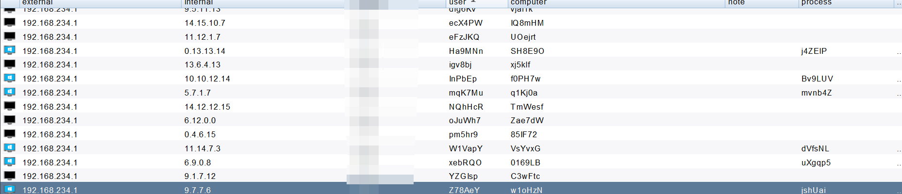

# CS_mock
模拟cobalt strike beacon上线包.  Simulation cobalt strike beacon connection packet.

拿到c2通信使用的RSA public key和提交metedata的url 即可模拟上线

Use the CobaltStrikeParser extract public key from the payload https://github.com/Sentinel-One/CobaltStrikeParser  parse_beacon_config.py payload_url --json

Remember to remove the extra padding from the public key



### 0x01 nmap scan from c2 server

`$ cScan 10.10.26.164 80`

```
Nmap scan report for 10.10.26.164
Host is up (0.0011s latency).

PORT   STATE SERVICE
80/tcp open  http
| grab_beacon_config_rsa:
|   x64:
|     sha256: 9356599e4b2c5d7bf63e309194df96cf8a763734aad80bc6dd78b8d1afb7e031
|     uri_queried: /4Ovd
|     config:
|       RSA Public Key: MIGfMA0GCSqGSIb3DQEBAQUAA4GNADCBiQKBgQCoeNuV/KkCl7dHwdyl8CIn1o5nHvVxquEs3k58509cojk+arW8dSzfPa2eVrjHtc4rMd7WGLif4AA9FaBwHgIdZ8J9K4xU1V9wWxF6iIFHcOT04KcFdZnJ4nXgMFrI7j4TYK1ugS9qV8u7C3Necrl38vRvOPi0kMYMiRO5KtT0KwIDAQABAAAAAAAAAAAAAAAAAAAAAAAAAAAAAAAAAAAAAAAAAA==
|       HTTP Method Path 2: /jquery-3.3.2.min.js
|       Beacon Type: 0 (HTTP)
|       C2 Host Header:
|       Method 1: GET
|       Spawn To x64: %windir%\sysnative\WerFault.exe
|       Watermark: 1234567890
|       C2 Server: 10.10.26.164,/jquery-3.3.1.min.js
|       Method 2: POST
|       Polling: 12022
|       Port: 80
|       Spawn To x86: %windir%\syswow64\WerFault.exe
|       Jitter: 50
|     sha1: 38fdc6f969f36518fcf4fd7116796152106b043c
|     md5: c64c52fddcf2853d7abb3500767be056
|     time: 1630908799494.2
|   x86:
|     sha256: 5889ac714f26c99d3e1ca63bb5508f69a1e501728cc8561c782c5b86592cf059
|     uri_queried: /HjIa
|     config:
|       RSA Public Key: MIGfMA0GCSqGSIb3DQEBAQUAA4GNADCBiQKBgQCoeNuV/KkCl7dHwdyl8CIn1o5nHvVxquEs3k58509cojk+arW8dSzfPa2eVrjHtc4rMd7WGLif4AA9FaBwHgIdZ8J9K4xU1V9wWxF6iIFHcOT04KcFdZnJ4nXgMFrI7j4TYK1ugS9qV8u7C3Necrl38vRvOPi0kMYMiRO5KtT0KwIDAQABAAAAAAAAAAAAAAAAAAAAAAAAAAAAAAAAAAAAAAAAAA==
|       HTTP Method Path 2: /jquery-3.3.2.min.js
|       Beacon Type: 0 (HTTP)
|       C2 Host Header:
|       Method 1: GET
|       Spawn To x64: %windir%\sysnative\WerFault.exe
|       Watermark: 1234567890
|       C2 Server: 10.10.26.164,/jquery-3.3.1.min.js
|       Method 2: POST
|       Polling: 12022
|       Port: 80
|       Spawn To x86: %windir%\syswow64\WerFault.exe
|       Jitter: 50
|     sha1: 3a7151d820dbe044031007c047b2a210e155f4c5
|     md5: b09ed49ea84ed65204ae81a05d97fa88
|_    time: 1630908798221.7

Nmap done: 1 IP address (1 host up) scanned in 3.83 seconds

```

RSA Public Key delete AAAAAAAAAAAAAAAAAAAAAAAAAAAAAAAAAAAAAAAAAA==

```
MIGfMA0GCSqGSIb3DQEBAQUAA4GNADCBiQKBgQCoeNuV/KkCl7dHwdyl8CIn1o5nHvVxquEs3k58509cojk+arW8dSzfPa2eVrjHtc4rMd7WGLif4AA9FaBwHgIdZ8J9K4xU1V9wWxF6iIFHcOT04KcFdZnJ4nXgMFrI7j4TYK1ugS9qV8u7C3Necrl38vRvOPi0kMYMiRO5KtT0KwIDAQAB
```

### c2-profile

```
header = {
        'Cookie': "__cfduid=" + base64.b64encode(enpack).decode('utf-8')
    }
```

#### Default:

```
GET /jquery-3.3.1.min.js HTTP/1.1
Accept-Encoding: identity
Host: 10.10.26.164
User-Agent: Python-urllib/3.9
Cookie: od8aPOC86rrPtnIJVmt5a4VjQMyjjzZxZrtuU2sOlGVZvO08c6od6PIjoS65qPrrX7Op036kjBB4QmAJd5pJUvGXpOYRB02v7reZZdAwpPEWwaxxUJxDBWovNcfYexw5dgCrbpVv/kKnAuemh1JYrAaYyvikRJvBrgQzjcOBBJM=
```

#### Cookie cfduid
```
GET /jquery-3.3.1.min.js HTTP/1.1
Accept: text/html,application/xhtml+xml,application/xml;q=0.9,*/*;q=0.8
Referer: http://code.jquery.com/
Accept-Encoding: gzip, deflate
Cookie: __cfduid=e4kfutNGa060S9mZiqDfitie2GtdNNctRVVxSktYsgO7mQ-w5QEAlr_PZVzr-U4NYky9FTh1-fMGvi1Jjm7bQRpQrhUR4Et0CSWcFQK9fn0RqKJp6oREleOddJ9avbI9PLZQHzIBqo1qfgCYrGsGvRMBn90usUMOK4cDjQ6UF24
User-Agent: Mozilla/5.0 (Windows NT 6.3; Trident/7.0; rv:11.0) like Gecko
Host: 10.10.26.164
Connection: Keep-Alive
Cache-Control: no-cache
```


